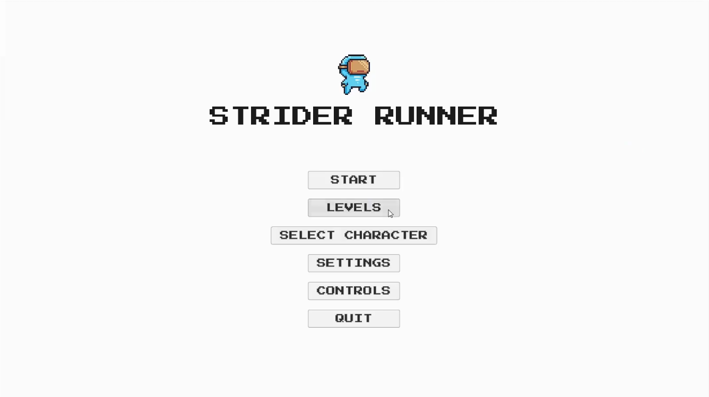
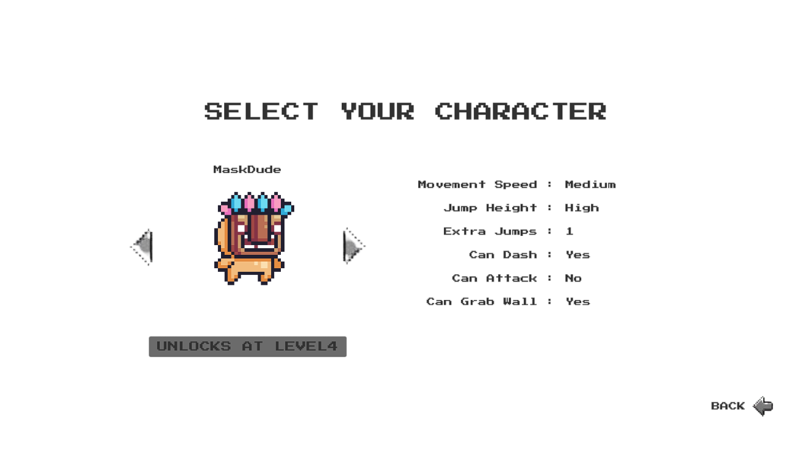
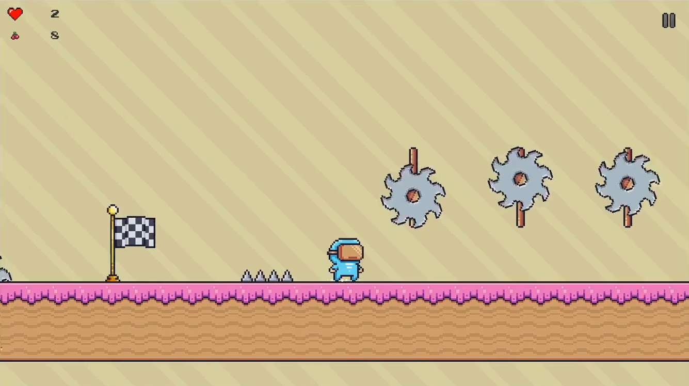
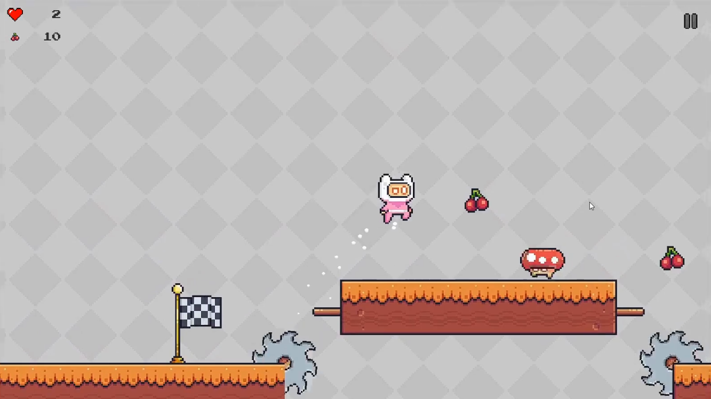
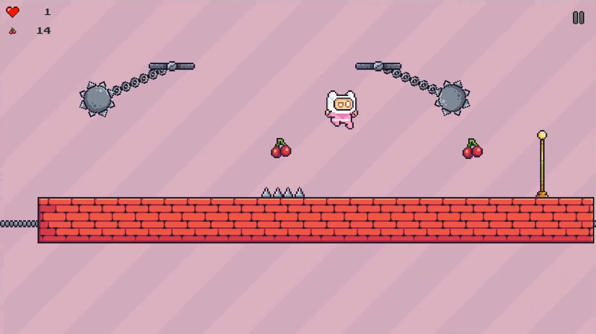
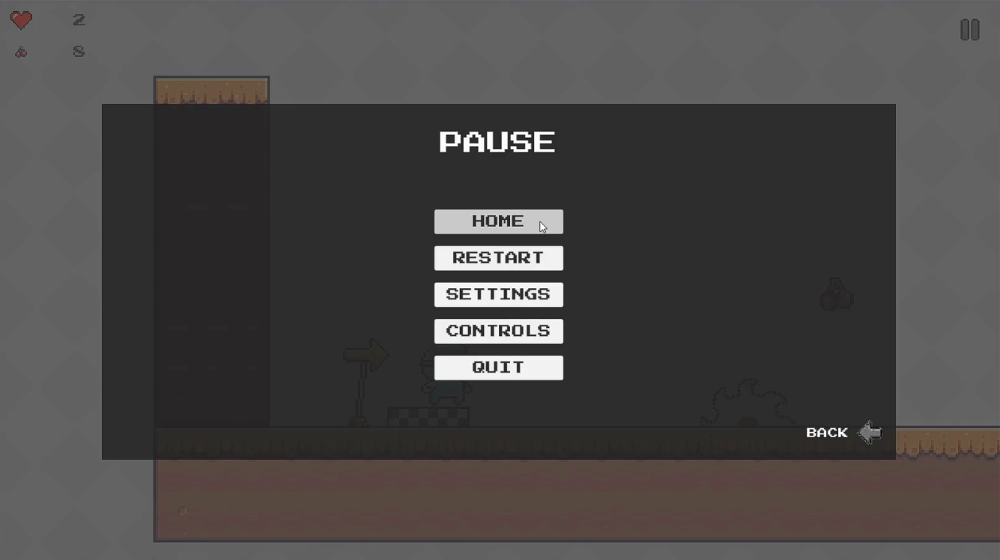
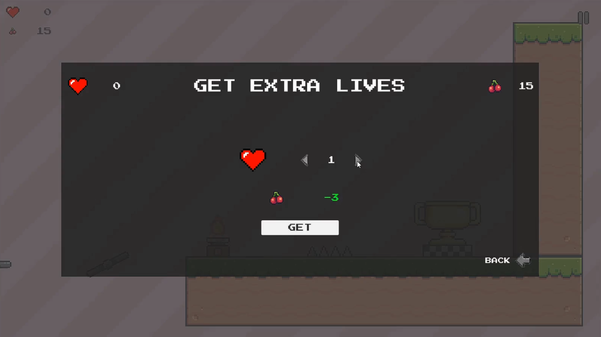

# Strider Runner

A fast, precision 2D platformer built with the Unity Engine. Strider Runner
combines classic side-scrolling movement with modern feel: tight controls,
double jump, air dash, wall grab, wall jump, ranged and melee enemies,
physics-driven traps, collectibles, checkpoints, and a multi-level campaign.

Author: Mithin Sagar S
GitHub: https://github.com/mithinsagar
License: MIT

---

## Table of Contents

1. Overview
2. Screenshots
3. Features
4. Technology Stack
5. Repository Layout
6. Getting Started
7. Controls
8. Gameplay Systems
9. Building the Game
10. Scripts Reference
11. Contributing
12. Roadmap
13. Credits
14. License

---

## 1. Overview

Strider Runner is a single-player 2D action platformer. The player picks a
character from a roster, each with a unique movement profile, and races through
a series of hand-crafted levels filled with traps, patrolling enemies, and
ranged shooters. The game emphasizes fluid movement: dashing through gaps,
wall-jumping up shafts, and chaining double-jumps across collapsing platforms.

The project is intended as both a playable game and a reference codebase for
Unity 2D platformer development, showcasing the new Input System, ScriptableObject
based character data, a lightweight audio manager, and a save system built on
PlayerPrefs.

## 2. Screenshots

| Start Screen | Character Selection |
| --- | --- |
|  |  |

| Gameplay | Gameplay |
| --- | --- |
|  |  |

| Gameplay | Pause Menu | Extra Lives |
| --- | --- | --- |
|  |  |  |

## 3. Features

- Tight 2D character controller with movement, flip, jump, extra (double) jump,
  wall grab, wall slide, wall jump, and air dash.
- Character selection screen with distinct movement stats per character.
- Level system with a start screen, seven levels, and an end screen.
- Checkpoint and respawn system with per-level save state.
- Enemies: patrolling melee and stationary ranged (projectile) variants.
- Trap kit: saw, spike, fire, falling platform, trampoline, sticky platform,
  fan, pendulum, rotating hazards, and death zones.
- Collectibles with an item collector and per-level counters.
- Audio manager with pooled sound effects and randomised background music.
- UI/UX for start, pause, game over, quit, insufficient lives, and extra lives
  screens.
- Unity Input System with rebindable action assets.
- PlayerPrefs-based save system covering unlocked levels, lives, and settings.
- Camera follower with configurable dead-zone and shake on impact.

## 4. Technology Stack

- Unity Engine (2D URP-compatible project template)
- C# scripts (`.NET` runtime shipped with Unity)
- Unity Input System (`com.unity.inputsystem`)
- Unity 2D Animation and SpriteShape
- Cinemachine (optional, camera authoring)
- TextMesh Pro for UI text rendering

Verified with Unity 2022 LTS and Unity 6 (any release supporting the package
versions listed in `Packages/manifest.json`).

## 5. Repository Layout

```
strider-runner/
├── README.md
├── LICENSE
├── CHANGELOG.md
├── CONTRIBUTING.md
├── CODE_OF_CONDUCT.md
├── SECURITY.md
├── AUTHORS.md
├── .gitignore
├── .gitattributes
├── .editorconfig
├── .vsconfig
├── StriderRunner.sln
│
├── Assets/
│   ├── Animations/
│   ├── Editor/
│   ├── Fonts/
│   ├── Input/
│   ├── Materials/
│   ├── Prefabs/
│   │   ├── Camera/
│   │   ├── Characters/
│   │   ├── Enemies/
│   │   ├── Environment/
│   │   │   ├── Checkpoints/
│   │   │   ├── Collectibles/
│   │   │   ├── Platforms/
│   │   │   └── Traps/
│   │   ├── Managers/
│   │   └── UI/
│   ├── Scenes/
│   ├── ScriptableObjects/
│   ├── Scripts/
│   │   ├── Audio/
│   │   ├── Camera/
│   │   ├── Enemy/
│   │   ├── Level/
│   │   ├── Objects/
│   │   ├── Player/
│   │   ├── UI/
│   │   └── Utilities/
│   ├── Sounds/
│   ├── Sprites/
│   └── TextMesh Pro/
│
├── Packages/
│   ├── manifest.json
│   └── packages-lock.json
│
├── ProjectSettings/
│
├── docs/
│   ├── Architecture.md
│   ├── GameDesign.md
│   ├── Controls.md
│   ├── Features.md
│   ├── BuildInstructions.md
│   ├── Roadmap.md
│   └── screenshots/
│
└── .github/
    ├── workflows/unity-ci.yml
    ├── ISSUE_TEMPLATE/
    │   ├── bug_report.md
    │   └── feature_request.md
    ├── PULL_REQUEST_TEMPLATE.md
    └── FUNDING.yml
```

## 6. Getting Started

Prerequisites: Unity Hub, a Unity Editor install compatible with the version
recorded in `ProjectSettings/ProjectVersion.txt`, and Git.

1. Clone the repository.

   ```
   git clone https://github.com/mithinsagar/strider-runner.git
   ```

2. Open Unity Hub, choose "Open project from disk", and select the cloned
   folder.

3. Let Unity import assets. On first import the editor will regenerate the
   `Library/`, `Temp/`, and IDE solution files. These are intentionally
   gitignored.

4. In the Project window open `Assets/Scenes/Start Screen.unity` and press
   Play.

## 7. Controls

Default keyboard layout (see `docs/Controls.md` for the full reference):

- Move: A / D or Left / Right arrows
- Jump: Space (also triggers a wall jump while clinging to a wall, or an
  extra air jump)
- Dash: Left Shift
- Wall Grab & Slide: automatic while airborne against a wall, for characters
  with wall grab enabled — no button needed
- Attack (sword-equipped character): K
- Pause: P

Gamepad bindings are defined in `Assets/Input/PlayerInputActions.inputactions`
and can be rebound at runtime through the Settings menu. The melee attack is
currently keyboard-only; no gamepad binding is wired up for it yet.

## 8. Gameplay Systems

- Player movement is authored in `Assets/Scripts/Player/PlayerMovement.cs`.
  Movement, dash, jump, wall grab, wall jump, and animation state transitions
  are all handled there.
- Character stats (speed, jump force, dash cooldown, whether wall grab is
  enabled) are exposed through `CharacterData` ScriptableObjects and applied
  at load time by `CharacterLoader`.
- Enemies inherit from a common damage contract in
  `Assets/Scripts/Enemy/EnemyDamage.cs`; patrolling motion is driven by
  `EnemyMovement.cs`, and ranged variants spawn projectiles via
  `RangedEnemy.cs` and `EnemyProjectile.cs`.
- Levels are named through the `LevelName` enum and orchestrated by
  `LevelManager`, `LevelLoader`, and `LevelStatus`.
- Traps and interactive objects live under `Assets/Scripts/Objects/`.

## 9. Building the Game

See `docs/BuildInstructions.md` for platform-specific steps. In short:

1. Open the project in the Unity Editor.
2. Add every scene in `Assets/Scenes/` to `File -> Build Settings` with
   `Start Screen` first, `Level1` through `Level7` next, then `End Screen`.
3. Pick a target platform, click "Switch Platform", then "Build".

## 10. Scripts Reference

- `Player/PlayerMovement.cs` - character controller.
- `Player/PlayerLife.cs` - health, damage, respawn.
- `Player/PlayerSwordAttack.cs` - melee attack for sword characters.
- `Player/CharacterData.cs` - ScriptableObject describing a playable character.
- `Player/CharacterLoader.cs` - applies the selected character on scene load.
- `Player/CharacterStatus.cs` - runtime status flags per character.
- `Audio/AudioManager.cs` - central audio playback, pooled and randomised.
- `Camera/CameraFollower.cs` - smooth follow camera.
- `Camera/CameraShaker.cs` - impact shake.
- `Level/LevelManager.cs` - level lifecycle, unlock tracking.
- `Level/LevelLoader.cs` - scene transitions.
- `Enemy/EnemyMovement.cs`, `Enemy/EnemyDamage.cs`, `Enemy/RangedEnemy.cs`,
  `Enemy/EnemyProjectile.cs` - enemy behaviour.
- `Objects/*` - trap and environment scripts.
- `UI/*` - menus and HUD.
- `Utilities/MonobehaviourSingleton.cs` - generic singleton base class.

## 11. Contributing

Contributions are welcome. Please read `CONTRIBUTING.md` before opening a pull
request. All contributions are made under the terms of the project license.

## 12. Roadmap

See `docs/Roadmap.md`. Highlights: gamepad UI navigation, input rebinding UI,
background parallax, additional enemy archetypes, and screen transition fades.

## 13. Credits

- Design, programming, and integration: Mithin Sagar S
  (https://github.com/mithinsagar)
- Font files bundled through TextMesh Pro.
- Sound effects and music are sourced from openly licensed libraries; see
  `docs/GameDesign.md` for the attribution list.

## 14. License

Released under the MIT License. See the `LICENSE` file at the project root.
